# Aterrizar.com — Deep Onboarding Documentation

> Microservicio de check-in aéreo. Spring Boot 3.5.5 · Java 24 · Redis · Groovy/Spock · Gradle multi-módulo.

---

## Tabla de Contenidos

1. [Visión General del Sistema](#1-visión-general-del-sistema)
2. [Estructura de Módulos](#2-estructura-de-módulos)
3. [API REST — Contrato](#3-api-rest--contrato)
4. [Modelo de Dominio](#4-modelo-de-dominio)
5. [Arquitectura de Capas y Patrones](#5-arquitectura-de-capas-y-patrones)
6. [Flujo de Inicialización — `/init`](#6-flujo-de-inicialización--init)
7. [Flujo General de Continuación — `/continue`](#7-flujo-general-de-continuación--continue)
8. [Flujo Venezuela — `/continue` con `country=VE`](#8-flujo-venezuela--continue-con-countryve)
9. [Feature Flag — Digital Visa](#9-feature-flag--digital-visa)
10. [Integraciones Externas](#10-integraciones-externas)
11. [Sesión en Redis](#11-sesión-en-redis)
12. [Tests de Integración](#12-tests-de-integración)
13. [Issue #17 — Flujo MX (Trabajo Planificado)](#13-issue-17--flujo-mx-trabajo-planificado)
14. [Guía de Setup Local](#14-guía-de-setup-local)

---

## 1. Visión General del Sistema

**Aterrizar.com Check-in Service** es un microservicio stateful que guía al usuario paso a paso por el proceso de check-in aéreo. El flujo es interactivo: el servicio responde con los campos que faltan (uno o varios) y el cliente los va completando en sucesivas llamadas `POST /continue` hasta llegar al estado `COMPLETED`.

El estado de la sesión persiste en **Redis** (TTL 1 hora). Las integraciones con sistemas externos (vuelos, experimentos A/B) se realizan mediante clientes HTTP reactivos con auto-registro en el contexto de Spring.

### Arquitectura de Alto Nivel

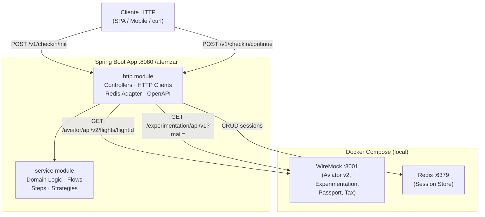

---

## 2. Estructura de Módulos

El proyecto usa **Gradle multi-módulo** con tres subproyectos definidos en [settings.gradle](../../settings.gradle):

```
aterrizar (root)
├── http/          ← Fat JAR Spring Boot, capa HTTP + adaptadores externos
├── service/       ← Librería de dominio puro, sin HTTP ni Redis
└── integration/   ← Tests de integración Groovy/Spock (requieren stack levantado)
```

### Dependencias entre Módulos

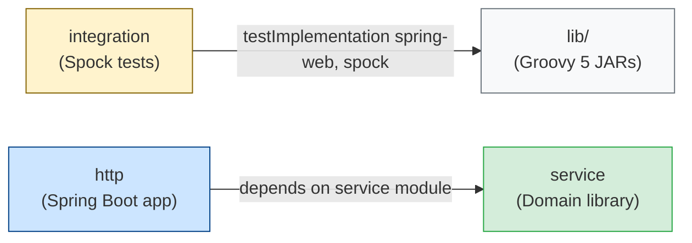

| Módulo | Responsabilidad | Artefacto |
|---|---|---|
| `http` | Controladores REST, clientes HTTP reactivos, adaptador Redis, generación OpenAPI | Fat JAR ejecutable |
| `service` | Lógica de negocio: flujos, steps, estrategias, modelos de dominio | JAR librería |
| `integration` | Tests end-to-end contra el stack levantado | No se publica |

**Archivos clave de configuración:**
- [build.gradle](../../build.gradle) — Checkstyle + Spotless para todos los módulos
- [http/build.gradle](../../http/build.gradle) — SpringBoot + OpenAPI Generator + Redis + WebFlux
- [service/build.gradle](../../service/build.gradle) — Solo Spring core (sin web)
- [http/src/main/resources/application.properties](../../http/src/main/resources/application.properties) — URLs externas, Redis, feature flags

---

## 3. API REST — Contrato

**Base URL:** `http://localhost:8080/aterrizar`  
**Swagger UI:** `http://localhost:8080/aterrizar/swagger-ui/index.html`  
**OpenAPI spec:** [http/src/main/resources/openapi/](http/src/main/resources/openapi/)  
**Código generado en:** `http/build/generated/` (se regenera en cada compilación)

### Endpoints

| Método | Path | Descripción |
|---|---|---|
| `POST` | `/v1/checkin/init` | Inicia una nueva sesión de check-in |
| `POST` | `/v1/checkin/continue` | Continúa la sesión proporcionando campos requeridos |

### `POST /v1/checkin/init`

**Request body:**
```json
{
  "country": "MX",
  "userId": "3fa85f64-5717-4562-b3fc-2c963f66afa6",
  "passengers": 2,
  "email": "user@example.com",
  "flightNumbers": ["USJFKGBLHF", "GBLHRMXMID"]
}
```

| Campo | Tipo | Regla |
|---|---|---|
| `country` | `CountryCode` enum (ISO 3166-1 alpha-2) | Requerido |
| `userId` | `string` (UUID) | Requerido |
| `passengers` | `integer` | Requerido, ≥ 1 |
| `email` | `string` (email format) | Requerido |
| `flightNumbers` | `array<string>` | Mínimo 1 ítem; cada código = exactamente 10 caracteres |

**Response body:**
```json
{
  "status": "initialized",
  "sessionId": "a1b2c3d4-..."
}
```

### `POST /v1/checkin/continue`

**Request body:**
```json
{
  "sessionId": "a1b2c3d4-...",
  "userId": "3fa85f64-...",
  "country": "MX",
  "providedFields": {
    "PASSPORT_NUMBER": "A12345678"
  }
}
```

**Response body:**
```json
{
  "status": "user_input_required",
  "inputRequiredFields": [
    { "id": "PASSPORT_NUMBER", "name": "Passport Number", "type": "TEXT" }
  ],
  "errorMessage": null
}
```

### HTTP Status por estado

| `StatusCode` | HTTP Status | Descripción |
|---|---|---|
| `INITIALIZED` | 200 OK | Solo en `/init` |
| `USER_INPUT_REQUIRED` | 206 Partial Content | Faltan campos |
| `COMPLETED` | 202 Accepted | Check-in completo |
| `REJECTED` | 400 Bad Request | Error de validación irrecuperable |

### Diagrama de Clases — Capa DTO

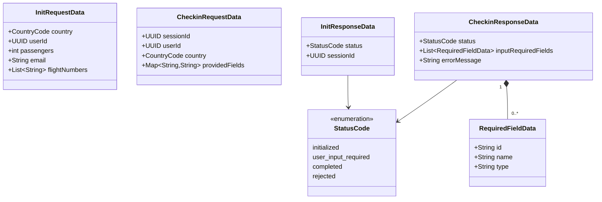

---

## 4. Modelo de Dominio

El dominio vive exclusivamente en el módulo `service`. No tiene dependencias HTTP ni de infraestructura.

### Diagrama de Clases — Dominio Completo

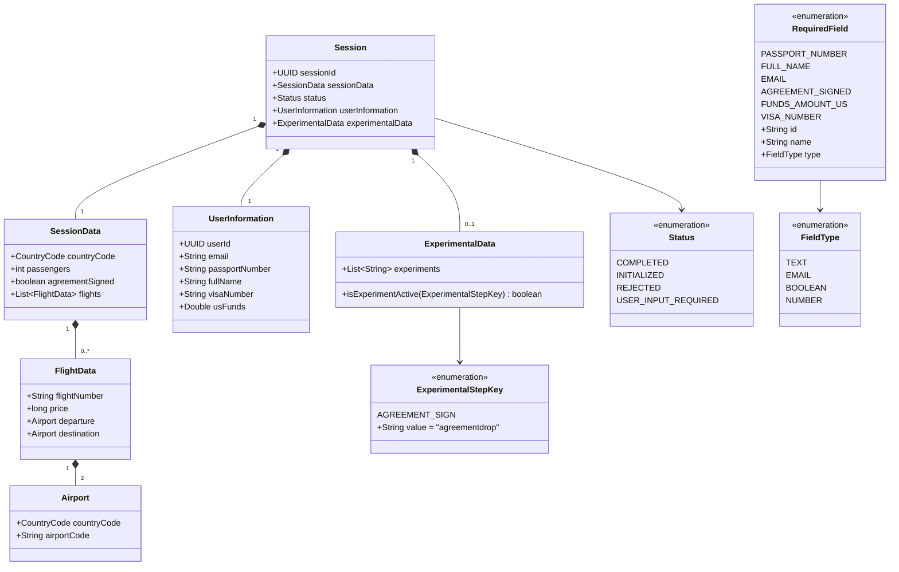

### Campos de `RequiredField`

| ID | Nombre Display | Tipo | Capturado por |
|---|---|---|---|
| `PASSPORT_NUMBER` | Passport Number | TEXT | `PassportInformationStep` |
| `FULL_NAME` | Full Name | TEXT | No implementado aún |
| `EMAIL` | Email | EMAIL | No implementado aún |
| `AGREEMENT_SIGNED` | Agreement Signed | BOOLEAN | `AgreementSignStep` |
| `FUNDS_AMOUNT_US` | US Funds | NUMBER | `FundsCheckStep` (VE only) |
| `VISA_NUMBER` | Digital Visa Number | TEXT | `DigitalVisaValidationStep` |

### Encoding del Código de Vuelo

Los códigos de vuelo de 10 caracteres codifican origen y destino:

```
U S J F K G B L H R
|_||___||_||___|
 ↑   ↑   ↑   ↑
 |   |   |   └── Aeropuerto destino (3 chars): LHR
 |   |   └────── País destino (2 chars): GB
 |   └────────── Aeropuerto origen (3 chars): JFK
 └────────────── País origen (2 chars): US
```

**Ejemplos de tests:**

| Código | Origen | Destino | ¿Requiere visa? |
|---|---|---|---|
| `USJFKGBLHF` | US/JFK | GB/LHF | No |
| `USJFKINDEL` | US/JFK | **IN**/DEL | **Sí (India)** |
| `USJFKAUSYD` | US/JFK | **AU**/SYD | **Sí (Australia)** |
| `GBLHRINDEL` | GB/LHR | **IN**/DEL | **Sí (India)** |
| `INDELAUSYD` | IN/DEL | **AU**/SYD | **Sí (Australia)** |

---

## 5. Arquitectura de Capas y Patrones

### Diagrama de Capas

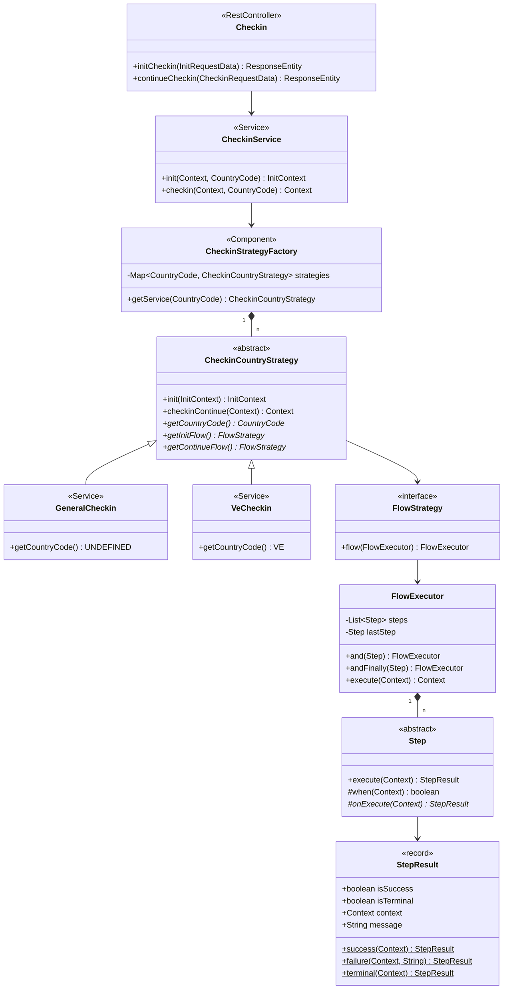

### Inventario de Patrones de Diseño

| Patrón | Clases involucradas | Propósito |
|---|---|---|
| **Strategy** | `CheckinCountryStrategy`, `GeneralCheckin`, `VeCheckin` | Lógica de flujo distinta por país |
| **Factory / Registry** | `CheckinStrategyFactory` | Resuelve la estrategia por `CountryCode` en runtime |
| **Chain of Responsibility** | `FlowExecutor`, `Step` | Cadena de pasos; el primero terminal corta la ejecución |
| **Template Method** | `Step.execute()` → `when()` + `onExecute()` | Todos los steps siguen la misma estructura |
| **Decorator** | `ExperimentalStepDecorator` | Envuelve un `Step` y lo activa solo si el experimento está activo |
| **Builder / Fluent** | `Context.with*()`, `FlowExecutor.and().andFinally()` | Construcción inmutable del contexto y del flow |
| **Adapter** | `AviatorGatewayAdapter`, `ExperimentalGatewayAdapter`, `SessionManagerAdapter` | Traducen DTOs externos al modelo de dominio |
| **Proxy dinámico** | `HttpClientConfig` + `HttpServiceProxyFactory` | Auto-registro de clientes HTTP vía `@HttpExchange` |
| **Factory Method** | `StatusMapperFactory` | Resuelve el mapper de respuesta HTTP por `StatusCode` |

---

## 6. Flujo de Inicialización — `/init`

El endpoint `/init` crea una nueva sesión de check-in. Todos los países usan el mismo `GeneralInitFlow`.

### Steps del `GeneralInitFlow`

```
CreateBaseSessionStep
  → CreateBaseSessionDataStep
  → FillExperimentsStep
  → RetrieveFlightsDataStep
  → SaveSessionStep
  → CompleteInitStep (terminal)
```

### Diagrama de Secuencia — Init

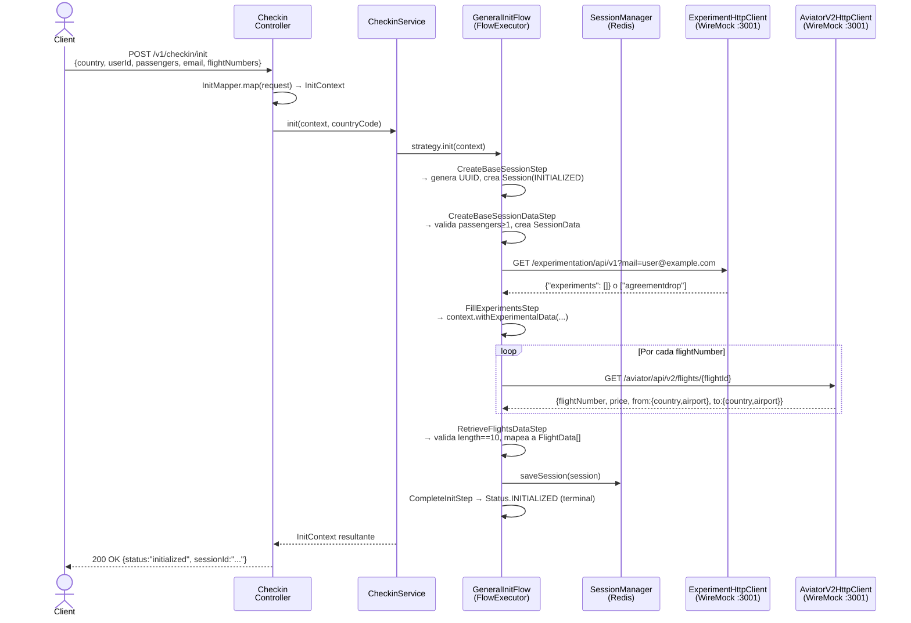

### Reglas de negocio del `/init`

| Step | Condición `when()` | Acción | Fallo → |
|---|---|---|---|
| `CreateBaseSessionStep` | Siempre | Genera UUID, crea `Session` con `UserInformation(userId, email)` | — |
| `CreateBaseSessionDataStep` | Siempre | Valida `passengers ≥ 1`, crea `SessionData` | `REJECTED`: "Passengers." |
| `FillExperimentsStep` | `userInformation != null && email != null` | Llama Experimentation API | — (no bloquea) |
| `RetrieveFlightsDataStep` | Siempre | Valida: lista no vacía, cada código = 10 chars; llama Aviator v2 | `REJECTED`: "No flight codes provided." / "Invalid flight codes." |
| `SaveSessionStep` | Siempre | Persiste en Redis (TTL 3600s) | — |
| `CompleteInitStep` | Siempre | `Status.INITIALIZED`, **terminal** | — |

---

## 7. Flujo General de Continuación — `/continue`

El endpoint `/continue` avanza la sesión. Se ejecuta múltiples veces hasta llegar a `COMPLETED`. Cada llamada puedes proveer campos en `providedFields`.

### Diagrama de Flujo — `GeneralContinueFlow`

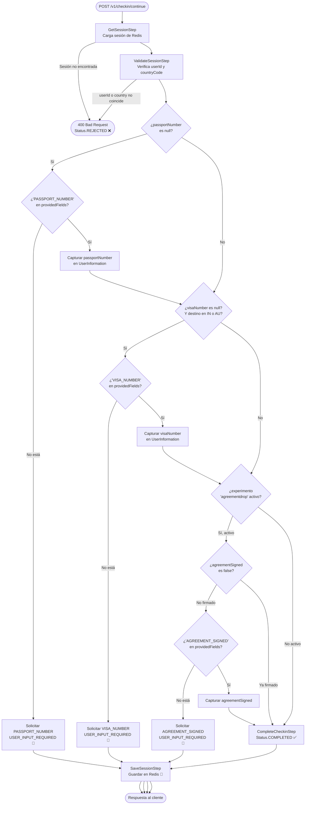

### Diagrama de Secuencia — Flujo Completo con Experimento

Este diagrama muestra el flujo más largo posible del `GeneralContinueFlow`: cuando el experimento `agreementdrop` está activo y el destino requiere visa.

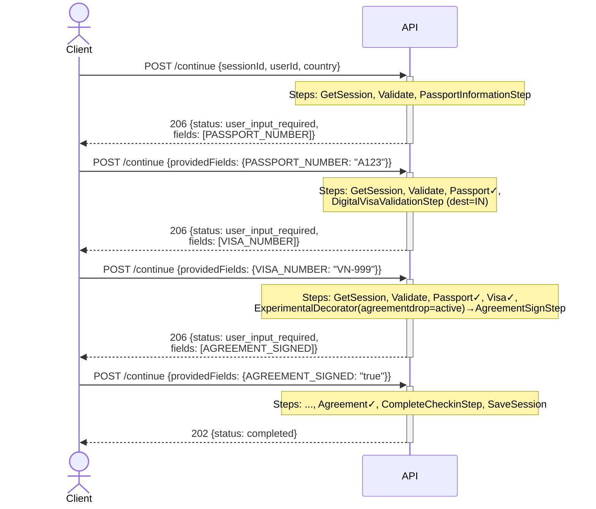

### El `ExperimentalStepDecorator`

El paso `AgreementSignStep` en `GeneralContinueFlow` está envuelto en `ExperimentalStepDecorator`:

```mermaid
flowchart LR
    Flow["GeneralContinueFlow"] --> Decorator["ExperimentalStepDecorator\n(key = AGREEMENT_SIGN)"]
    Decorator -->|when = experiments.contains('agreementdrop')| AgreementStep["AgreementSignStep"]
    Decorator -->|cuando experimento inactivo| Skip["Step se omite completamente"]
```

**Cómo habilitar el experimento en WireMock:** El email debe seguir el patrón `test__agreementdrop@checkin.com`.  
WireMock extrae el nombre del experimento del email (`agreementdrop`) y lo devuelve como experimento activo.

---

## 8. Flujo Venezuela — `/continue` con `country=VE`

Venezuela tiene su propia estrategia (`VeCheckin`) con un flujo diferente (`VeContinueFlow`).

### Diferencias VE vs General

| Aspecto | General | Venezuela (VE) |
|---|---|---|
| Step adicional | — | `FundsCheckStep` (captura fondos en USD) |
| Orden de steps | Passport → Visa → Agreement? | **Funds → Passport → Agreement** |
| `AgreementSignStep` | Gateado por experimento `agreementdrop` | **Siempre se ejecuta** (no experimental) |
| Digital Visa | Sí (si destino en IN/AU) | No (no está en `VeContinueFlow`) |

### Diagrama de Flujo — `VeContinueFlow`

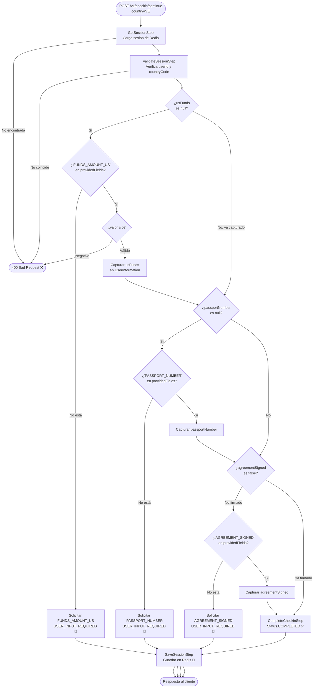

### Diagrama de Secuencia — Flujo VE Completo

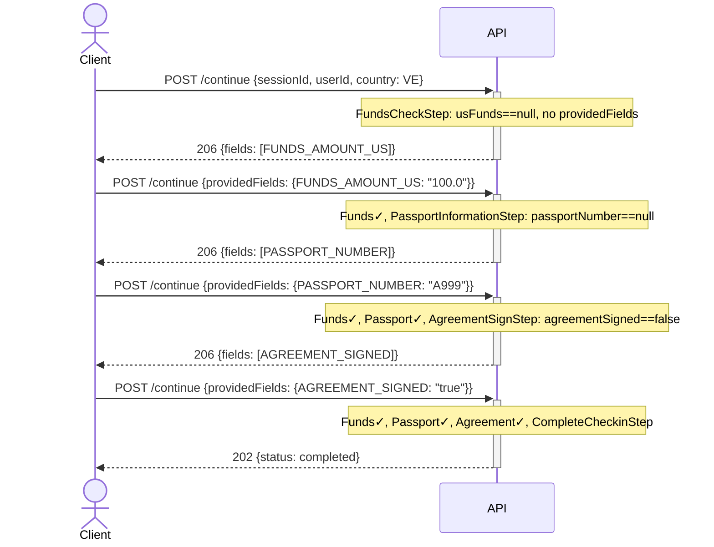

---

## 9. Feature Flag — Digital Visa

### Regla de Negocio

Si cualquier vuelo de la sesión tiene como **país destino** uno de los países habilitados (`IN` o `AU`), se solicita un número de visa digital (`VISA_NUMBER`) antes de completar el check-in.

**Configuración en [application.properties](../../http/src/main/resources/application.properties):**
```properties
feature.digital.visa.enabled-countries=IN,AU
```

La clase [DigitalVisaConfig.java](../../http/src/main/java/com/aterrizar/http/config/feature/DigitalVisaConfig.java) implementa la interfaz `DigitalVisaFeature` del módulo `service`, manteniendo la separación entre dominio e infraestructura.

### Lógica del `DigitalVisaValidationStep.when()`

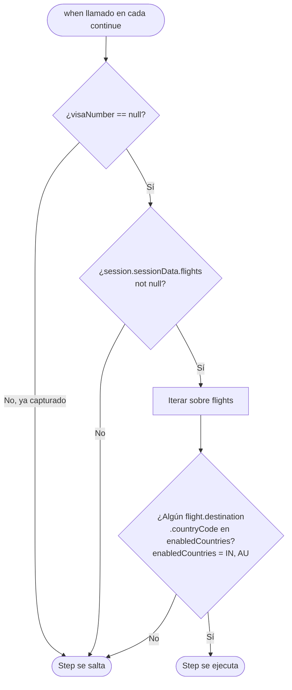

### Diagrama de Secuencia — Digital Visa Habilitada

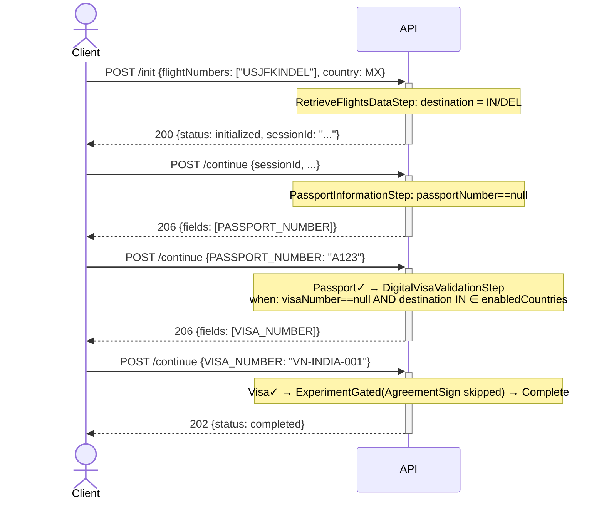

---

## 10. Integraciones Externas

### Mapa de Integraciones

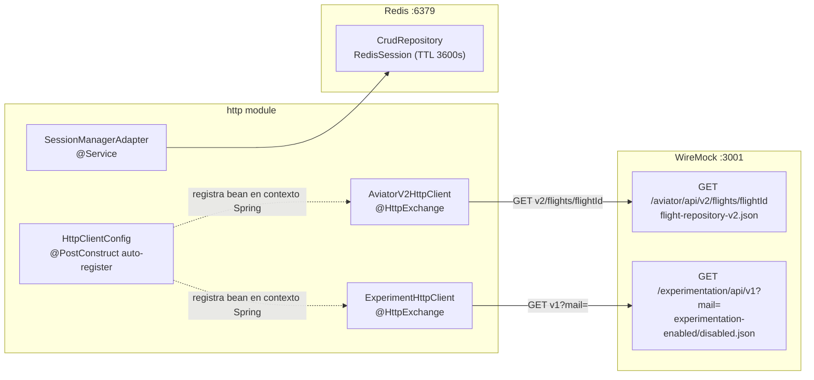

### Auto-Registro de Clientes HTTP

Todos los clientes HTTP se registran automáticamente en el arranque de la aplicación:

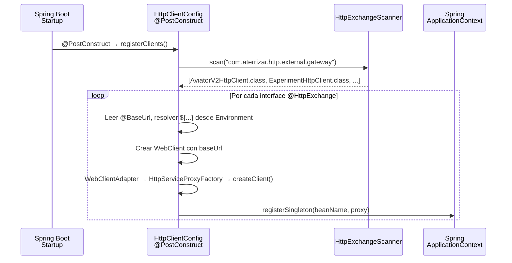

**Para agregar un nuevo cliente HTTP:**
1. Crear interfaz con `@HttpExchange` y `@BaseUrl("${propiedad.url}")` en `com.aterrizar.http.external.gateway`
2. El scanner lo detecta automáticamente
3. No es necesario ningún `@Bean` manual

### Clientes HTTP Registrados

| Interfaz | Base URL | Endpoint | Modelo respuesta |
|---|---|---|---|
| `AviatorV2HttpClient` | `http.client.aviator.base.url` | `GET v2/flights/{flightId}` | `FlightDto(flightNumber, price:String, from, to)` |
| `ExperimentHttpClient` | `http.client.experimental.platform.base.url` | `GET v1?mail={email}` | `ExperimentsDto(experiments:List<String>)` |

### WireMock — Comportamiento de los Stubs

#### Flight Repository v2 (`flight-repository-v2.json`)

WireMock decodifica el flight code con regex para generar la respuesta dinámicamente. Lo que hace el stub es exactamente lo mismo que la regla de codificación del código de vuelo:

```
flightId = "USJFKGBLHR"
from.country  = regex('^[A-Za-z]{2}')                        → "US"
from.airport  = regex('(?<=^[A-Za-z]{2})[A-Za-z]{3}')        → "JFK"
to.country    = regex('(?<=^[A-Za-z]{2}[A-Za-z]{3})[A-Za-z]{2}') → "GB"
to.airport    = regex('(?<=^[A-Za-z]{2}[A-Za-z]{3}[A-Za-z]{2})[A-Za-z]{3}') → "LHR"
price         = random 4 digits + "00"
```

#### Experimentation (`experimentation-enabled.json`)

El patrón de email `test__EXPERIMENT_KEY@checkin.com` activa el experimento:

```
email = "test__agreementdrop@checkin.com"
→ experimentos activos: ["agreementdrop"]

email = "user@example.com"
→ experimentos activos: []
```

---

## 11. Sesión en Redis

### Ciclo de Vida de la Sesión

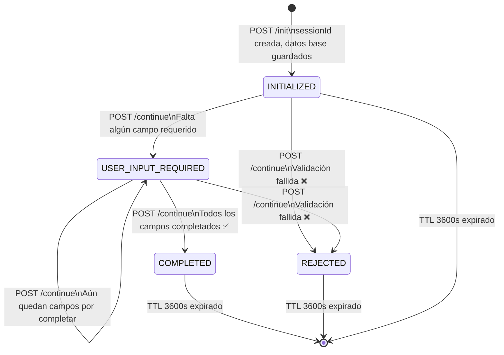

### Estructura en Redis

```
Key:    Session:{sessionId}     (hash en Redis)
TTL:    3600 segundos (1 hora)
Value:  RedisSession {
          redisId: "3fa85f64-..."   (= sessionId.toString())
          session: Session {        (serializado)
            sessionId, sessionData, status,
            userInformation, experimentalData
          }
        }
```

### Diagrama de Clases — Capa Redis

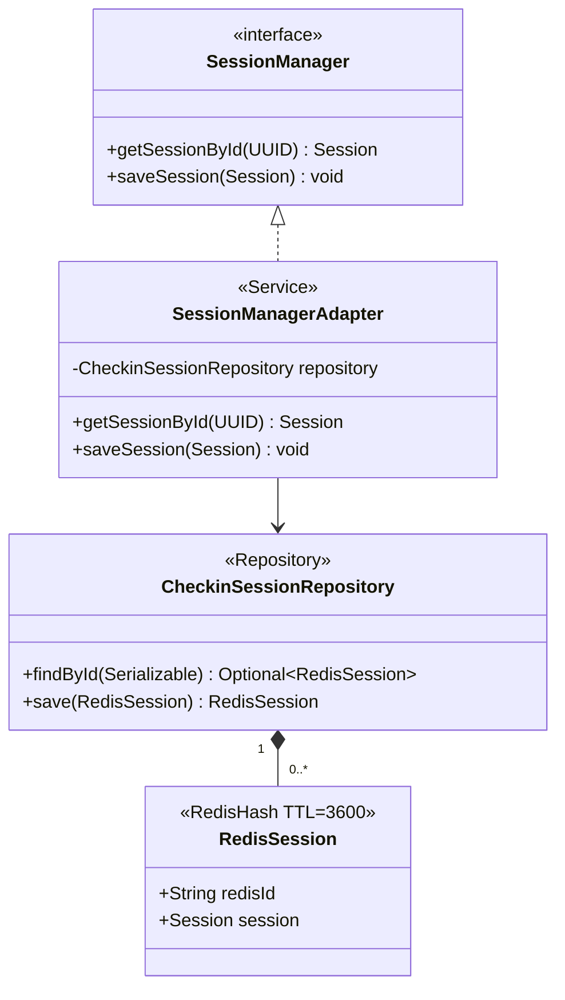

---

## 12. Tests de Integración

Los tests de integración usan **Spock Framework** (Groovy) y requieren el stack completo levantado con Docker Compose.

**Cómo ejecutar:**
```bash
docker compose up -d          # Levanta WireMock + Redis
./gradlew :http:bootRun &     # Arranca la aplicación
./gradlew :integration:integrationTest  # Ejecuta tests
```

### Arquitectura del Framework de Tests

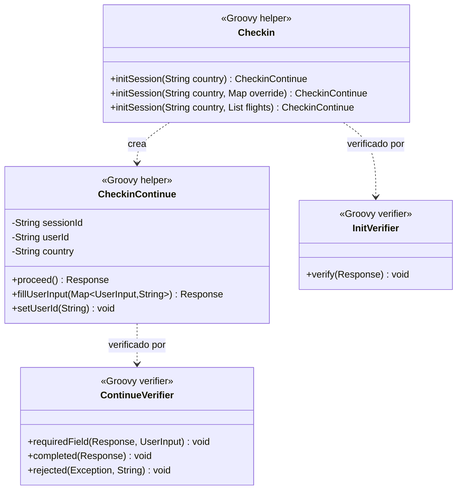

### Escenarios de Tests por Suite

#### `InitFlowTest.groovy`

| Escenario | Entrada | Resultado esperado |
|---|---|---|
| Init exitoso | `country=MX`, datos base | `status=initialized`, `sessionId` válido |

#### `ContinueFlowTest.groovy` (General / MX)

| Escenario | Pasos | Resultado esperado |
|---|---|---|
| userId no coincide | Init MX → cambiar userId → proceed | `REJECTED` "User ID does not match session" |
| Solicitar passport | Init MX → proceed (sin campos) | `USER_INPUT_REQUIRED` [PASSPORT_NUMBER] |
| Flujo corto (sin exp.) | Init MX → fill PASSPORT | `COMPLETED` (sin experimento activo) |
| Flujo completo sin exp. | Init MX → proceed → fill PASSPORT | `COMPLETED` |
| Flujo con agreementdrop | Init MX (email `test__agreementdrop@checkin.com`) → fill PASSPORT → fill AGREEMENT=true | `COMPLETED` |

#### `VeContinueFlowTest.groovy`

| Escenario | Pasos | Resultado esperado |
|---|---|---|
| userId no coincide | Init VE → cambiar userId → proceed | `REJECTED` |
| Flujo parcial | Init VE → proceed → fill FUNDS → fill PASSPORT | `USER_INPUT_REQUIRED` [AGREEMENT_SIGNED] |
| Flujo completo | Init VE → fill FUNDS → fill PASSPORT → fill AGREEMENT=true | `COMPLETED` |

#### `DigitalVisaFlowTest.groovy`

| Escenario | Flight codes | Resultado |
|---|---|---|
| Solicitar visa para India | `[USJFKINDEL]` | `USER_INPUT_REQUIRED` [VISA_NUMBER] |
| Solicitar visa para Australia | `[USJFKAUSYD]` | `USER_INPUT_REQUIRED` [VISA_NUMBER] |
| Completar con visa India | `[USJFKINDEL]` fill PASSPORT + VISA | `COMPLETED` |
| No solicitar visa para UK | `[USJFKGBLHR]` | `COMPLETED` sin pedir visa |
| Cualquier vuelo a India o AU | `[USJFKGBLHR, GBLHRINDEL]` | `USER_INPUT_REQUIRED` [VISA_NUMBER] |
| Múltiples destinos visa | `[USJFKINDEL, INDELAUSYD]` fill PASSPORT + VISA | `COMPLETED` |

---

## 13. Issue #17 — Flujo MX (Trabajo Planificado)

Ver detalles completos en [issue#17.md](issue%2317.md) y [plan_issue#17.md](plan_issue%2317.md).

### Requerimiento

Actualmente México (`MX`) cae en el flujo `GeneralContinueFlow` (via `UNDEFINED` fallback). El Issue #17 introduce un flujo específico para México con cumplimiento fiscal:

1. Capturar el **RFC** (Registro Federal de Contribuyentes — ID fiscal mexicano)
2. Calcular el **monto de impuestos** via servicio externo `GET /tax-service/v1/calculate?rfc={rfc}`
3. Obtener la **firma digital** del contribuyente para el monto calculado

### Flujo MX Planificado (`MxContinueFlow`)

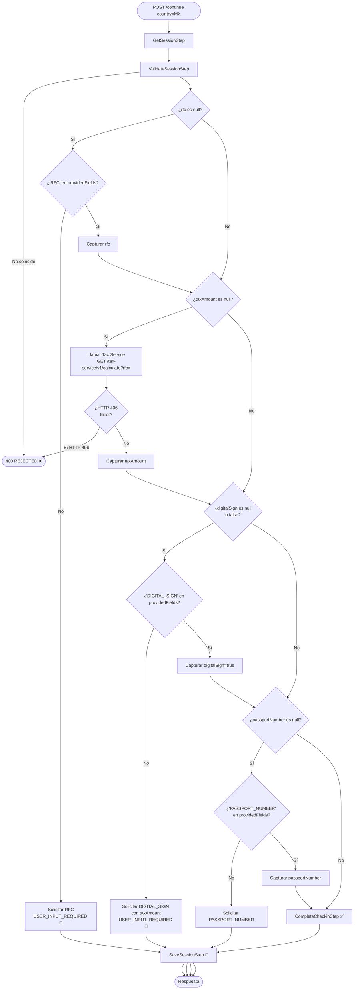

### Archivos a Crear/Modificar

#### Módulo `service`

| Archivo | Cambio |
|---|---|
| `UserInformation.java` | Agregar `rfc`, `taxAmount`, `digitalSign` |
| `RequiredField.java` | Agregar `RFC`, `DIGITAL_SIGN` |
| `TaxGateway.java` | Nueva interfaz: `TaxData getTax(String rfc)` |
| `TaxData.java` | Nuevo record: `(double taxAmount)` |
| `RfcInputStep.java` | Nuevo step: captura RFC |
| `TaxCalculationStep.java` | Nuevo step: llama `TaxGateway`, 406 → failure |
| `TaxAgreementStep.java` | Nuevo step: captura `DIGITAL_SIGN` |
| `MxContinueFlow.java` | Nuevo flow: compone los steps anteriores |
| `MxCheckin.java` | Nueva estrategia: `CountryCode.MX` |

#### Módulo `http`

| Archivo | Cambio |
|---|---|
| `TaxDto.java` | Nuevo model: `(double taxAmount)` |
| `TaxHttpClient.java` | Nuevo cliente: `@HttpExchange`, `GET calculate?rfc=` |
| `TaxGatewayAdapter.java` | Nuevo adapter: implementa `TaxGateway` |
| `application.properties` | Agregar `http.client.tax.base.url` |

#### Docker / WireMock

| Mapping | Comportamiento |
|---|---|
| `tax-service-success.json` | RFC sin terminar en `1` → 200 `{"taxAmount":45.00}` |
| `tax-service-error.json` | RFC terminando en `1` → 406 |

---

## 14. Guía de Setup Local

### Prerrequisitos

| Herramienta | Versión |
|---|---|
| Java JDK | 24+ |
| Docker | 20+ |
| Docker Compose | v2 |

### Pasos

**1. Levantar infraestructura:**
```bash
docker compose up -d
```
Esto inicia:
- WireMock en `http://localhost:3001` (Aviator, Experimentation, PersonaGov)
- Redis en `localhost:6379`

**2. Compilar y arrancar la aplicación:**
```bash
./gradlew :http:bootRun
```
App disponible en `http://localhost:8080/aterrizar`

**3. Explorar la API:**
```
Swagger UI:  http://localhost:8080/aterrizar/swagger-ui/index.html
OpenAPI JSON: http://localhost:8080/aterrizar/openapi
```

### Ejemplo de Flujo Completo (curl)

```bash
# 1. Iniciar sesión
SESSION=$(curl -s -X POST http://localhost:8080/aterrizar/v1/checkin/init \
  -H "Content-Type: application/json" \
  -d '{
    "country": "MX",
    "userId": "3fa85f64-5717-4562-b3fc-2c963f66afa6",
    "passengers": 2,
    "email": "user@example.com",
    "flightNumbers": ["USJFKGBLHF"]
  }')
echo $SESSION
# → {"status":"initialized","sessionId":"<UUID>"}

SESSION_ID=$(echo $SESSION | grep -oP '"sessionId":"\K[^"]+')

# 2. Continuar (faltará PASSPORT_NUMBER)
curl -s -X POST http://localhost:8080/aterrizar/v1/checkin/continue \
  -H "Content-Type: application/json" \
  -d "{
    \"sessionId\": \"$SESSION_ID\",
    \"userId\": \"3fa85f64-5717-4562-b3fc-2c963f66afa6\",
    \"country\": \"MX\",
    \"providedFields\": {}
  }"
# → {"status":"user_input_required","inputRequiredFields":[{"id":"PASSPORT_NUMBER",...}]}

# 3. Proveer passport → COMPLETED
curl -s -X POST http://localhost:8080/aterrizar/v1/checkin/continue \
  -H "Content-Type: application/json" \
  -d "{
    \"sessionId\": \"$SESSION_ID\",
    \"userId\": \"3fa85f64-5717-4562-b3fc-2c963f66afa6\",
    \"country\": \"MX\",
    \"providedFields\": {\"PASSPORT_NUMBER\": \"A12345678\"}
  }"
# → {"status":"completed","inputRequiredFields":null,"errorMessage":null}
```

### Ejecutar Tests

```bash
# Tests unitarios (no requieren Docker)
./gradlew test

# Tests de integración (requieren Docker + app corriendo)
docker compose up -d
./gradlew :http:bootRun &
./gradlew :integration:integrationTest

# Verificar calidad de código
./gradlew checkstyleMain
./gradlew spotlessCheck
```

---

*Generado el 28 de febrero de 2026. Para contribuir o reportar errores, ver [README.md](../../README.md).*
