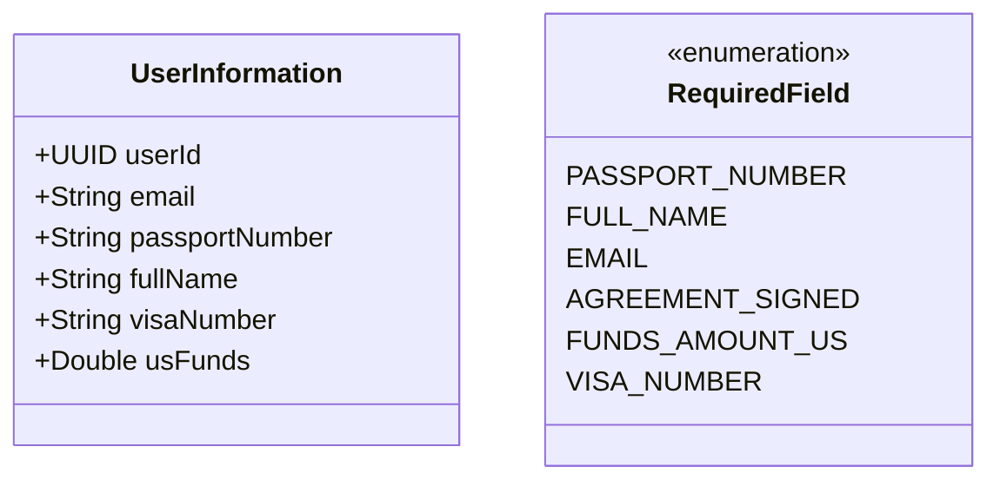
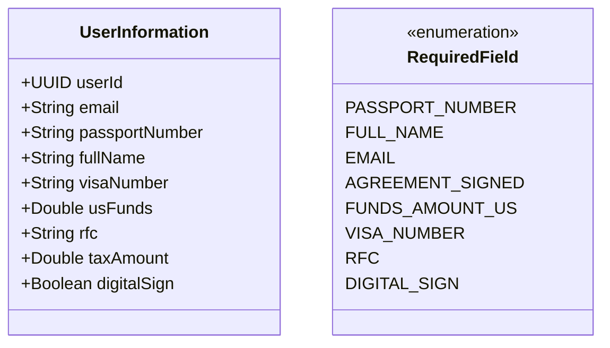
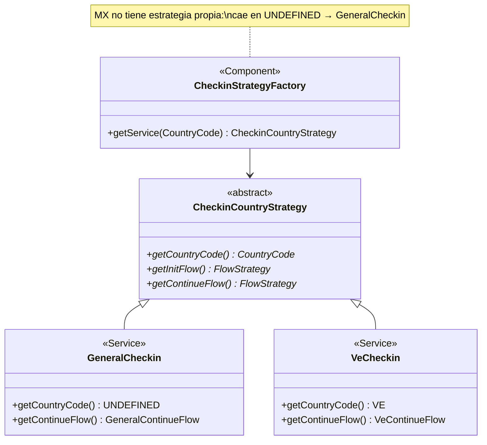
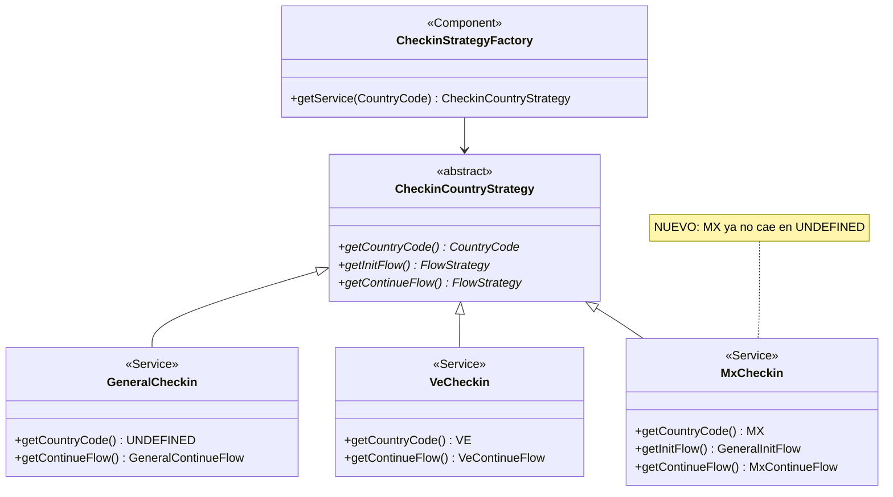
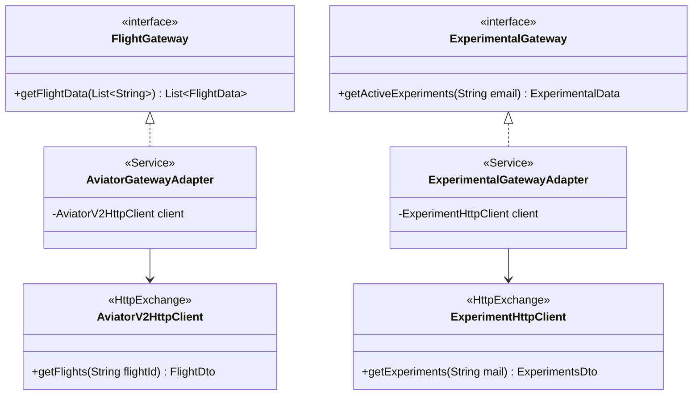
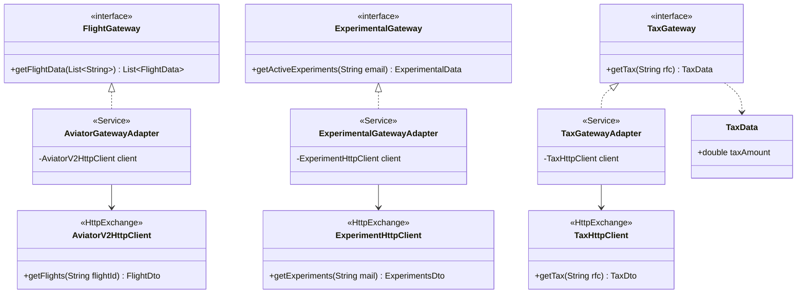
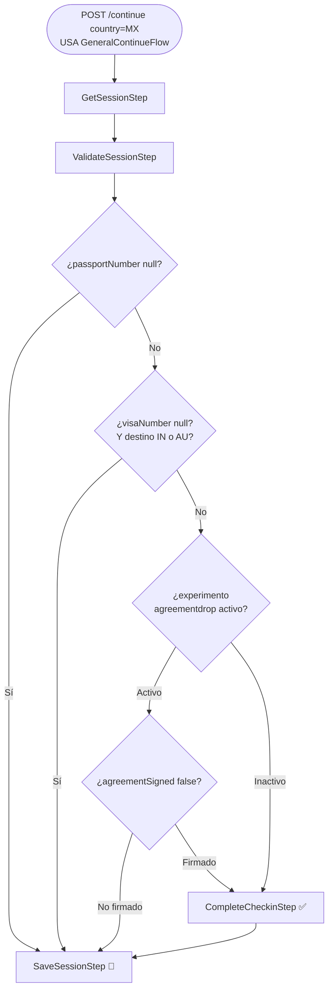
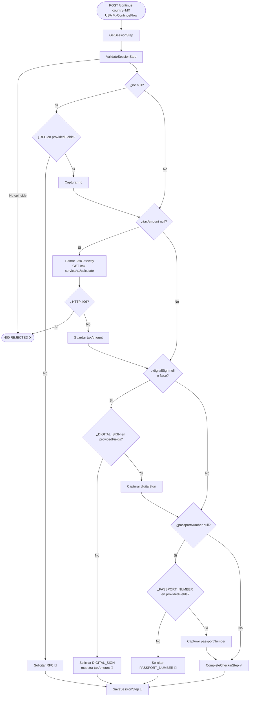
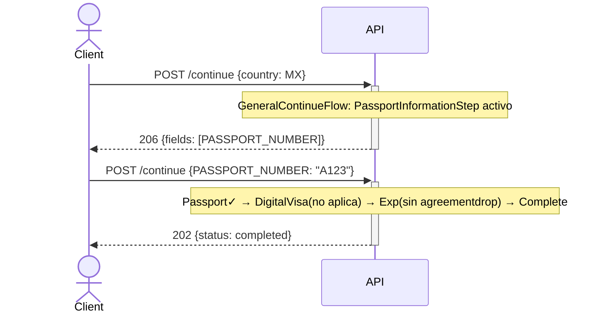
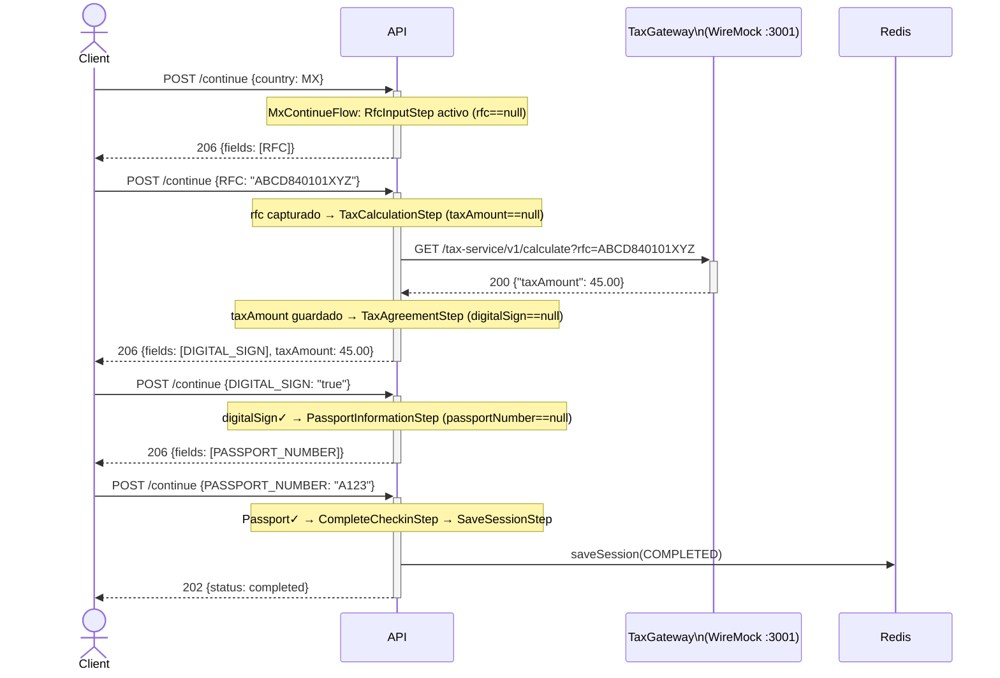

## Plan: Mexico (MX) Tax Compliance Check-in Flow

**TL;DR** — El issue requiere crear una estrategia de check-in específica para México (`CountryCode.MX`) que exige RFC, calcula impuestos vía un servicio externo y requiere firma digital. La arquitectura ya establece patrones claros con `VeCheckin` como referencia para estrategias por país y `ExperimentalGatewayAdapter` como referencia para clientes HTTP externos. No existe ningún código MX actualmente; los usuarios MX caen en `GeneralCheckin` como fallback.

---

### Módulos y archivos a tocar

**`service` module** — lógica de dominio pura:

1. **Nuevo modelo** [service/src/main/java/.../core/model/session/UserInformation.java](../../service/src/main/java/com/aterrizar/service/core/model/session/UserInformation.java) — agregar 3 campos nullables: `@Nullable String rfc`, `@Nullable Double taxAmount`, `@Nullable Boolean digitalSign`

2. **Nuevo enum value** [service/src/main/java/.../core/model/RequiredField.java](../../service/src/main/java/com/aterrizar/service/core/model/RequiredField.java) — agregar `RFC("RFC", "RFC Number", TEXT)` y `DIGITAL_SIGN("DIGITAL_SIGN", "Digital Sign", BOOLEAN)`

3. **Nueva interfaz gateway** [service/src/main/java/.../external/TaxGateway.java](../../service/src/main/java/com/aterrizar/service/external/TaxGateway.java) (nueva) — interfaz `TaxGateway { TaxData getTax(String rfc); }`

4. **Nuevo modelo de dominio** [service/src/main/java/.../core/model/session/TaxData.java](../../service/src/main/java/com/aterrizar/service/core/model/session/TaxData.java) (nuevo record) — `record TaxData(double taxAmount)`; también puede añadirse el campo `taxAmount` directamente en `UserInformation` sin record separado.

5. **Nuevo Step** [service/src/main/java/.../checkin/steps/RfcInputStep.java](../../service/src/main/java/com/aterrizar/service/checkin/steps/RfcInputStep.java) — `when`: `rfc == null`; comportamiento: si el request tiene RFC en `providedFields`, capturarlo con `withUserInformation(b -> b.rfc(...))`; si no, retornar `terminal(context.withRequiredField(RFC))`

6. **Nuevo Step** [service/src/main/java/.../checkin/steps/TaxCalculationStep.java](../../service/src/main/java/com/aterrizar/service/checkin/steps/TaxCalculationStep.java) — `when`: `rfc != null && taxAmount == null`; llama `TaxGateway.getTax(rfc)`, actualiza contexto; en error 406 → `failure(context, "Invalid RFC")`; depende de `TaxGateway`

7. **Nuevo Step** [service/src/main/java/.../checkin/steps/TaxAgreementStep.java](../../service/src/main/java/com/aterrizar/service/checkin/steps/TaxAgreementStep.java) — `when`: `taxAmount != null && (digitalSign == null || !digitalSign)`; si request tiene `digitalSign=true`, captura y continúa; si no, retorna `terminal(context.withRequiredField(DIGITAL_SIGN))`; debería incluir el `taxAmount` en el mensaje de respuesta

8. **Nuevo Flow** [service/src/main/java/.../checkin/flow/MxContinueFlow.java](../../service/src/main/java/com/aterrizar/service/checkin/flow/MxContinueFlow.java) — implementa `FlowStrategy`; cadena: `GetSessionStep → ValidateSessionStep → RfcInputStep → TaxCalculationStep → TaxAgreementStep → PassportInformationStep → CompleteCheckinStep`, `.andFinally(SaveSessionStep)`

9. **Nueva estrategia country** [service/src/main/java/.../checkin/country/MxCheckin.java](../../service/src/main/java/com/aterrizar/service/checkin/country/MxCheckin.java) — extiende `CheckinCountryStrategy`; `getCountryCode()` = `CountryCode.MX`; `getInitFlow()` = `GeneralInitFlow`; `getContinueFlow()` = `MxContinueFlow`

---

**`http` module** — adaptadores HTTP externos:

10. **Nuevo DTO** [http/src/main/java/.../external/gateway/tax/model/v1/TaxDto.java](../../http/src/main/java/com/aterrizar/http/external/gateway/tax/model/v1/TaxDto.java) (nuevo record) — `record TaxDto(double taxAmount)`

11. **Nuevo HTTP client** [http/src/main/java/.../external/gateway/tax/TaxHttpClient.java](../../http/src/main/java/com/aterrizar/http/external/gateway/tax/TaxHttpClient.java) — interfaz anotada con `@BaseUrl("${http.client.tax.base.url}")` + `@HttpExchange("v1/")` + método `@GetExchange("calculate") TaxDto getTax(@RequestParam("rfc") String rfc)`. Al estar en el paquete `com.aterrizar.http.external.gateway`, `HttpExchangeScanner` + `HttpClientConfig` lo registrarán automáticamente como bean Spring.

12. **Nuevo adapter** [http/src/main/java/.../external/gateway/tax/TaxGatewayAdapter.java](../../http/src/main/java/com/aterrizar/http/external/gateway/tax/TaxGatewayAdapter.java) — `@Service`, implementa `TaxGateway`; inyecta `TaxHttpClient`; mapea `TaxDto → UserInformation` update vía context

13. **`application.properties`** [http/src/main/resources/application.properties](../../http/src/main/resources/application.properties) — agregar `http.client.tax.base.url=http://localhost:3001/tax-service/`

---

**`docker/wiremock` module** — stubs para tests de integración:

14. **Nuevo mapping éxito** [docker/wiremock/mappings/tax-service-success.json](../../docker/wiremock/mappings/tax-service-success.json) — `GET /tax-service/v1/calculate?rfc=<RFC que NO termina en 1>` → HTTP 200 `{"taxAmount":45.00}`

15. **Nuevo mapping error** [docker/wiremock/mappings/tax-service-error.json](../../docker/wiremock/mappings/tax-service-error.json) — `GET /tax-service/v1/calculate?rfc=<RFC que termina en 1>` → HTTP 406

---

**`integration` module** — tests de integración:

16. **Agregar `UserInput` values** [integration/src/main/groovy/.../model/UserInput.java](../../integration/src/main/groovy/com/aterrizar/integration/model/UserInput.java) — agregar `RFC` y `DIGITAL_SIGN` al enum Groovy para poder usarlos en `fillUserInput()`

17. **Nuevo test** [integration/src/test/groovy/.../test/mx/MxContinueFlowTest.groovy](../../integration/src/test/groovy/com/aterrizar/integration/test/mx/MxContinueFlowTest.groovy) — Spock Specification con escenarios:
    - Happy path completo: init("MX") → proceed() (pide RFC) → fill(RFC) → proceed() (pide DIGITAL_SIGN con tax 45.00) → fill(DIGITAL_SIGN=true) → proceed() (pide passport) → fill(passport) → completed
    - Error: RFC terminado en `1` → rejected con error de impuesto
    - Flujo ya tiene RFC en sesión (no lo pide de nuevo): saltar `RfcInputStep`

---

**Tests unitarios** (en `service` module):

18. [service/src/test/java/.../steps/RfcInputStepTest.java](../../service/src/test/java/com/aterrizar/service/checkin/steps/RfcInputStepTest.java) — probar: sin RFC pide el campo; con RFC en request lo captura y continúa; `when()` retorna false si RFC ya está en contexto

19. [service/src/test/java/.../steps/TaxCalculationStepTest.java](../../service/src/test/java/com/aterrizar/service/checkin/steps/TaxCalculationStepTest.java) — probar: con RFC presente llama gateway y actualiza contexto; `when()` es false si taxAmount ya presente; fallo 406 retorna `failure`

20. [service/src/test/java/.../steps/TaxAgreementStepTest.java](../../service/src/test/java/com/aterrizar/service/checkin/steps/TaxAgreementStepTest.java) — probar: sin `digitalSign` pide el campo; con `digitalSign=true` aprueba y continúa; `when()` es false si digitalSign ya es true

---

### Dependencias entre pasos

```
RfcInputStep ──terminalIfAbsent──► (RFC en contexto)
    ↓ cuando RFC presente
TaxCalculationStep ──llama─► TaxGateway ──► WireMock /tax-service/v1/calculate
    ↓ cuando taxAmount presente
TaxAgreementStep ──terminalIfAbsent──► (digitalSign=true en contexto)
    ↓ cuando digitalSign=true
PassportInformationStep → CompleteCheckinStep
```

---

### Consideraciones para pruebas

- **Unit tests**: mockear `TaxGateway` para `TaxCalculationStep`. Mockear `Context` con builders. Simular los 3 escenarios de `StepResult` (`success`, `terminal`, `failure`).
- **Integration tests**: el orden en `MxContinueFlow` es crítico — los steps deben ser idempotentes (el `when()` correcto es la clave). La sesión persiste en Redis entre llamadas, así que `rfc` y `taxAmount` estarán guardados después del primer ciclo de steps que llegue a `SaveSessionStep`.
- **WireMock**: el patrón de URL exacto del issue es `GET /tax-service/v1/calculate?rfc={rfc}`. Los stubs usan `queryParameters.rfc.matches` / `doesNotMatch` con regex `.*1$`
- **`FieldType.BOOLEAN`**: `RequiredFieldMapper` ya maneja `BOOLEAN` — acepta `"true"` o `"false"`. `DIGITAL_SIGN` debe declararse como `BOOLEAN` en el enum `RequiredField`.
- **Ordering en `MxContinueFlow`**: el `PassportInformationStep` viene **después** de los pasos de impuesto, no antes. Diferencia importante del flujo general.
- **`TaxGatewayAdapter` error handling**: cuando WireMock devuelve 406, Spring `WebClient` lanzará una excepción HTTP. El adapter debe atraparla y relanzar como excepción de dominio, o el `TaxCalculationStep` debe capturar el error y retornar `StepResult.failure(...)`.

---

### Verificación

1. `./gradlew :service:test` — los 3 unit tests nuevos pasan
2. `./gradlew :http:build` — compila sin errores (Checkstyle + Spotless)
3. `docker-compose up -d` → `./gradlew :integration:integrationTest` — el nuevo `MxContinueFlowTest` pasa
4. Test manual con curl: secuencia de 3 llamadas POST a `/aterrizar/v1/checkin/continue` simulando el flujo MX

---

### Decisiones

- **`TaxData` como campo en `UserInformation`** en lugar de un record separado — consistente con cómo `usFunds` ya vive en `UserInformation` directamente
- **Error 406 del tax service → `StepResult.failure`** — bloquea el check-in con mensaje claro, consistente con `DigitalVisaValidationStep` que también falla por error externo
- **`MxContinueFlow` no hereda de `VeContinueFlow`** — composición directa con `FlowExecutor` para máxima claridad, siguiendo el patrón de `VeContinueFlow`


---

### Distribución de trabajo — 5 programadores

> El criterio de distribución balancea **cantidad de tareas**, **complejidad** y **dependencias entre tareas**. Las tareas del Dev 1 son el punto de partida crítico; el resto puede trabajar en paralelo una vez desbloqueadas.

#### Dev 1 — Fundación de Dominio *(prerequisito del resto)*

Tareas base que no tienen dependencias internas y que desbloquean a todos los demás. Ideal para el programador más familiarizado con el módulo `service`.

| # | Tarea | Complejidad |
|---|---|---|
| 1 | `UserInformation.java` — agregar `rfc`, `taxAmount`, `digitalSign` | Baja |
| 2 | `RequiredField.java` — agregar `RFC` y `DIGITAL_SIGN` | Baja |
| 3 | `TaxGateway.java` — nueva interfaz de dominio | Baja |
| 4 | `TaxData.java` — nuevo record de dominio | Baja |

**Estimado:** 2–3 horas. Debe completarse primero para que el resto pueda compilar.

---

#### Dev 2 — Steps RFC y Cálculo de Impuestos *(depende de Dev 1)*

Dos steps con lógica de negocio y sus tests unitarios. El `TaxCalculationStep` requiere manejo de errores HTTP (captura WebClientResponseException 406).

| # | Tarea | Complejidad |
|---|---|---|
| 5 | `RfcInputStep.java` — captura RFC o pide el campo | Media |
| 6 | `TaxCalculationStep.java` — llama `TaxGateway`, 406 → failure | Media-Alta |
| 18 | `RfcInputStepTest.java` — unit tests del step RFC | Media |
| 19 | `TaxCalculationStepTest.java` — unit tests con mock del gateway | Media |

**Estimado:** 4–6 horas. Referencia: `PassportInformationStep` para RFC, `AviatorGatewayAdapter` para manejo de error HTTP.

---

#### Dev 3 — Step de Firma Digital + Flujo MX *(depende de Dev 1)*

Completa el tercer step de negocio y ensambla el flujo MX completo. La estrategia `MxCheckin` es trivial una vez que el flujo existe.

| # | Tarea | Complejidad |
|---|---|---|
| 7 | `TaxAgreementStep.java` — captura `digitalSign` o pide el campo | Media |
| 8 | `MxContinueFlow.java` — cadena completa de steps | Media |
| 9 | `MxCheckin.java` — estrategia `CountryCode.MX` | Baja |
| 20 | `TaxAgreementStepTest.java` — unit tests del step de firma | Media |

**Estimado:** 4–5 horas. Referencia: `VeContinueFlow` para el flujo, `AgreementSignStep` para el step de firma.

---

#### Dev 4 — Capa HTTP Externa *(depende de Dev 1 para `TaxGateway`)*

Todo lo del módulo `http`: DTO, cliente HTTP, adapter y configuración. El scanner `HttpExchangeScanner` registra el cliente automáticamente si está en el paquete correcto.

| # | Tarea | Complejidad |
|---|---|---|
| 10 | `TaxDto.java` — record DTO de respuesta | Baja |
| 11 | `TaxHttpClient.java` — interfaz `@HttpExchange` + `@BaseUrl` | Baja |
| 12 | `TaxGatewayAdapter.java` — `@Service` que implementa `TaxGateway` | Media |
| 13 | `application.properties` — agregar `http.client.tax.base.url` | Trivial |

**Estimado:** 3–4 horas. Referencia directa: `ExperimentHttpClient` + `ExperimentalGatewayAdapter`.

---

#### Dev 5 — Infraestructura de Tests e Integración *(depende de todos los anteriores)*

Stubs WireMock (pueden hacerse desde el inicio, independientemente), actualización del enum Groovy y el test de integración end-to-end que valida el flujo completo.

| # | Tarea | Complejidad |
|---|---|---|
| 14 | `tax-service-success.json` — WireMock: RFC válido → 200 | Baja |
| 15 | `tax-service-error.json` — WireMock: RFC termina en `1` → 406 | Baja |
| 16 | `UserInput.groovy` — agregar `RFC` y `DIGITAL_SIGN` al enum | Trivial |
| 17 | `MxContinueFlowTest.groovy` — 3 escenarios Spock end-to-end | Alta |

**Estimado:** 4–6 horas. Los stubs WireMock (14 y 15) se pueden adelantar en paralelo desde el día 1.

---

#### Orden de ejecución recomendado

```
Día 1
├── Dev 1: Tareas 1–4          ← desbloquea a todos, máxima prioridad
├── Dev 4: Tareas 10–11 + 13   ← DTO, client interface y properties (no dependen de Dev 1)
└── Dev 5: Tareas 14–16        ← WireMock stubs y enum Groovy (independientes)

Día 1–2 (en cuanto Dev 1 termine)
├── Dev 2: Tareas 5–6 + 18–19  ← steps RFC + Tax y sus unit tests
└── Dev 3: Tareas 7–9 + 20     ← step firma, MxContinueFlow, MxCheckin y unit test

Día 2–3 (en cuanto Dev 4 tenga TaxGateway)
└── Dev 4: Tarea 12            ← TaxGatewayAdapter (necesita la interfaz del Dev 1)

Día 3 (en cuanto todo lo anterior esté merged)
└── Dev 5: Tarea 17            ← MxContinueFlowTest end-to-end
```


---

### Antes y Después — Impacto Visual del Issue #17

> Contraste entre el estado actual del sistema (según `GENERAL_PROJECT_DOCUMENTATION.md`) y el estado final tras implementar el plan.

---

#### 1. Modelo de Dominio — `UserInformation` y `RequiredField`

**ANTES** — los campos de dominio no contemplan datos fiscales mexicanos:



**DESPUÉS** — se añaden tres campos fiscales en `UserInformation` y dos valores en `RequiredField`:



---

#### 2. Estrategias por País — `CheckinStrategyFactory`

**ANTES** — México cae en el fallback `UNDEFINED` / `GeneralCheckin`:



**DESPUÉS** — México tiene su propia estrategia y flujo de negocio:



---

#### 3. Integraciones Externas — Gateways y Clientes HTTP

**ANTES** — dos gateways externos: vuelos y experimentos:



**DESPUÉS** — se añade el gateway fiscal `TaxGateway` con su adapter y cliente HTTP:



---

#### 4. Flujo `/continue` para país MX

**ANTES** — MX usa `GeneralContinueFlow` (fallback): no pide RFC ni impuestos:



**DESPUÉS** — MX usa `MxContinueFlow`: pasos fiscales antes del pasaporte:



---

#### 5. Secuencia — Flujo MX completo antes y después

**ANTES** — un usuario MX completa el check-in genérico (sin RFC, sin impuestos):



**DESPUÉS** — el mismo usuario MX pasa por RFC y firma fiscal antes del pasaporte:



---

#### Resumen del impacto

| Componente | Antes | Después |
|---|---|---|
| `UserInformation` | 6 campos | **9 campos** (+rfc, +taxAmount, +digitalSign) |
| `RequiredField` | 6 valores | **8 valores** (+RFC, +DIGITAL_SIGN) |
| Estrategias country | 2 (UNDEFINED, VE) | **3** (+MX) |
| Flujos de continuación | 2 (General, Ve) | **3** (+MxContinueFlow) |
| Steps totales | 11 | **14** (+RfcInputStep, +TaxCalculationStep, +TaxAgreementStep) |
| Gateways dominio | 3 (Flight, Experimental, Session) | **4** (+TaxGateway) |
| Clientes HTTP | 2 (AviatorV2, Experiment) | **3** (+TaxHttpClient) |
| WireMock mappings | 6 | **8** (+tax-service-success, +tax-service-error) |
| Llamadas /continue para MX | 2 (passport → done) | **4** (rfc → tax confirm → passport → done) |
